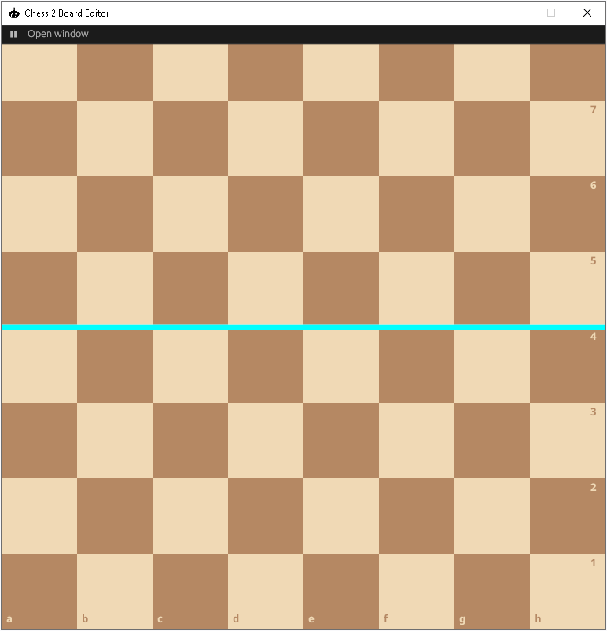

# About
---

`chess2-canvas` is an in-progress board editor for David Sirlin's [Chess 2: The Sequel](https://en.wikipedia.org/wiki/Chess_2:_The_Sequel) and built using the [Bevy game engine](https://bevyengine.org/). It can be used to show off board positions, or play correspondence games (although no rules are implemented).

# Problem Decomposition
---

- [x] Draw an 8x8 grid of black and white squares.
- [x] Draw the midline, between ranks 4 and 5.
- [x] Draw notation for files (a-h) and ranks (1-8) 
- [x] Write logic to fill up window with board
- [ ] Write current board state to FEN2 string
- [ ] Flip Board - pieces, and notation
- [ ] Save board as PNG
- [ ] 'Hand' mode
	- [ ] Highlight Piece square when clicked & held
	- [ ] Draw transparent piece on square clicked
	- [x] Draw piece sprite that follows cursor whilst left mouse is held down
	- [x] Draw piece on hovered-over square when left mouse is released
	- [ ] Erase transparent piece from previous square when left mouse released
	- [ ] Erase highlight from previous square when left mouse released 
	- [ ] Draw circle on hovered-over square when right mouse pressed
	- [ ] Draw arrow between right-clicked square and hovered-over square when right mouse pressed, held, & dragged
	- [ ] Erase arrows on left mouse press
	- [ ] Erase circles on left mouse press
- [ ] 'Pieces' mode
	- [ ] Draw Piece on hovered-over square on left mouse press
	- [ ] Overwrite piece on hovered-over square on left mouse press with new piece
	- [ ] Cycle through different armies with A/D keys
		- [ ] Overwrite pieces from old army with new army
	- [ ] Cycle through piece to place with 1/2/3/4/5/6
- [ ] 'Trash' mode
	- [ ] Erase piece on hovered-over square on left mouse press
- [ ] FEN
	- [ ] Parse FEN2 to board position 
	- [ ] Parse Fischerrandom to board position by value (as per the [most recent ruleset](https://static1.squarespace.com/static/575f8cb8ab48de461197681a/t/5f2e3acc0fe05d162d2c0834/1596865230951/chess2_rulebook3-0.pdf))

